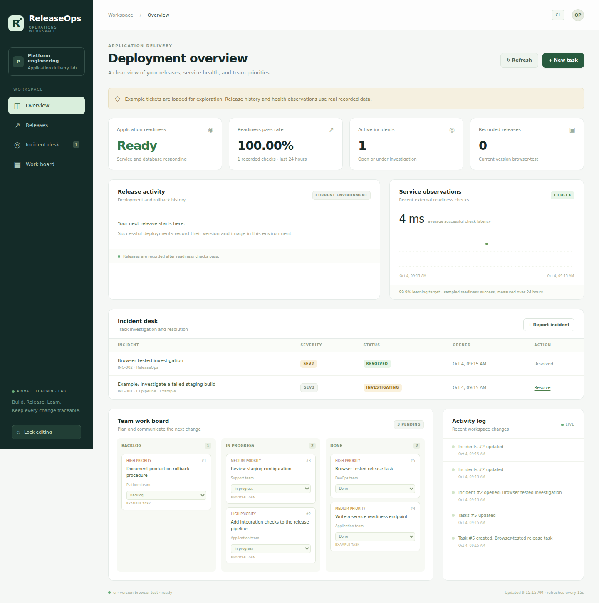

# ReleaseOps

**A practical DevOps portfolio project: application delivery, release management, incident support, and operational documentation.**

Built for the responsibilities in an Associate DevOps Engineer role. The project contains a working Python/SQLite application, an operations dashboard, a GitHub Actions pipeline, Docker deployment automation, health monitoring, backups, and an optional AWS EC2 Terraform template.



Preview from the browser test workspace; example tickets are labeled and the health check is a real local observation.

## Start locally

Requirements: **Python 3.12+** and a browser. No Python packages or cloud account are needed.

```bash
git clone https://github.com/psatyasaiganesh-oss/ReleaseOps.git
cd ReleaseOps
python3 scripts/dev.py --demo
```

On Windows, use `python` in place of `python3`. Open **http://localhost:8080**. The `--demo` flag adds explicitly labeled example tasks and an example incident; it never creates fake health observations or deployment records. Omit it for an empty workspace.

To edit, click **Unlock editing** and paste the token from `.local/dev-token`:

```bash
cat .local/dev-token
```

Windows PowerShell: `Get-Content .local/dev-token`. The browser retains the token only in memory for the current tab. Click **Lock editing** to clear it. Stop the server with Ctrl+C.

In a second terminal, collect real readiness observations:

```bash
python3 scripts/monitor.py
```

The dashboard refreshes every 15 seconds. It shows tasks, incidents, the release ledger, recorded readiness pass rate, recent check latency, and an activity log. A 99.9% target is a learning target; sampled readiness success is not proof of contractual SLA compliance.

## Verify the project

```bash
python3 -m unittest discover -s tests -v
python3 scripts/rehearse.py
python3 scripts/smoke.py
```

Run the smoke check while the local app is running. Unit/integration tests and the local rehearsal create isolated temporary databases and clean up their application processes. The rehearsal starts v1, releases v2, blocks a failed candidate, restores v2, preserves a task, and replays observations collected during downtime. It uses real Python processes, not containers or AWS.

For browser testing, optional Node tooling is in `tests/browser.cjs`; install Playwright as described in [docs/VALIDATION.md](docs/VALIDATION.md). Python runtime dependencies remain zero.

## Deploy with Docker

Requirements: Linux or WSL, Bash, Python 3.12+, `flock`, Docker, and Docker Compose v2 supporting `up --wait`.

```bash
docker build --build-arg VERSION=1.0.0 -t releaseops:1.0.0 .
PULL_IMAGE=0 bash scripts/deploy.sh staging releaseops:1.0.0
```

Open **http://localhost:18081**. Staging and production use separate Docker projects, volumes, token files, and ports. Production uses port **18080**. Both ports bind to loopback; use an SSH tunnel for remote access. The containers run as a non-root user, with a read-only filesystem and persistent `/data` storage.

The deploy script serializes releases, waits for container readiness, checks application environment and optional version, records the successful release, and remembers the previous image. If readiness or registration fails, it attempts to restore the previous image. On a failed first deployment, no prior image is available.

Deploy another version and exercise manual rollback:

```bash
docker build --build-arg VERSION=1.0.1 -t releaseops:1.0.1 .
PULL_IMAGE=0 bash scripts/deploy.sh staging releaseops:1.0.1
PULL_IMAGE=0 bash scripts/rollback.sh staging
```

Test the container deployment scripts on an isolated namespace and volume:

```bash
bash scripts/container_rehearsal.sh
```

This test verifies successful releases, automatic rollback after an unhealthy candidate, manual rollback, and database persistence. It removes its own test containers/volume afterward.

## GitHub CI/CD

Source repository: [psatyasaiganesh-oss/ReleaseOps](https://github.com/psatyasaiganesh-oss/ReleaseOps).

`.github/workflows/pipeline.yml` provides:

1. Python 3.12/3.13 application tests, a local release rehearsal, and real browser checks.
2. Actual Docker deployment/rollback checks on a GitHub-hosted Linux runner.
3. Terraform formatting and validation without creating cloud resources.
4. Image publication to GitHub Container Registry after all checks pass on `main`.
5. Optional deployment from **Actions → ReleaseOps CI/CD → Run workflow**, selecting `staging` or `production`.

Pull requests only run checks. Published images have commit-specific tags; deployment uses an immutable image digest. CD runs on a Linux x64 self-hosted runner with the custom label `releaseops`. Configure GitHub environments and production approval rules before enabling that runner. See [docs/DEPLOYMENT.md](docs/DEPLOYMENT.md) for setup.

## Optional AWS lab

`infra/aws` creates one EC2 lab host in an existing VPC/public subnet, with an encrypted disk, IMDSv2, and SSH restricted to the administrator CIDR. Docker is installed by user data. Docker Compose and the GitHub runner require host setup. It does not deploy the application by itself.

Follow [docs/DEPLOYMENT.md](docs/DEPLOYMENT.md). No AWS resources have been created. Review a Terraform plan and your account’s costs before applying; destroy the lab when finished.

## How it matches the role

| JD responsibility | Project evidence |
|---|---|
| Translate requirements into technical specifications | [Requirements and acceptance criteria](docs/REQUIREMENTS.md) |
| Prepare system designs and flowcharts | [Architecture and release flow](docs/ARCHITECTURE.md) |
| Build, test, and maintain software | Python REST API, SQLite persistence, application tests |
| Automate CI/CD | GitHub Actions build, test, publish, and deploy jobs |
| Deployment and release management | Separate environments, health gating, image history, rollback |
| Investigate errors and support systems | Incident lifecycle, JSON request logs, readiness and metrics |
| Document production operating tasks | [Runbook](docs/RUNBOOK.md), backups, failure drill |
| Agile collaboration | Kanban tasks with owners, priority, and status |

## Documentation

- [Technical requirements](docs/REQUIREMENTS.md)
- [Architecture and design](docs/ARCHITECTURE.md)
- [API reference](docs/API.md)
- [Deployment and GitHub setup](docs/DEPLOYMENT.md)
- [Operations, backup, and incident runbook](docs/RUNBOOK.md)
- [Security decisions and limitations](docs/SECURITY.md)
- [Validation results](docs/VALIDATION.md)
- [Interview walkthrough](docs/INTERVIEW.md)

This is a private learning lab. The Python standard-library HTTP server and shared operator token are intentionally simple. A real customer production rollout needs a supported production server/reverse proxy, TLS, individual identities, authorization, rate limiting, and operational review. Single-host container replacement has downtime; rollback preserves the database and does not undo incompatible schema changes.

## Repository map

```text
releaseops/             Python API, SQLite persistence, and dashboard
scripts/               Startup, monitoring, deployments, rollback, backups, rehearsals
tests/                 API/integration tests and unhealthy Docker fixture
.github/workflows/     CI/CD pipeline
infra/aws/             Optional EC2 Terraform template
docs/                  Requirements, architecture, API, runbooks, interview guide
```

MIT license. No affiliation with NTT DATA.
