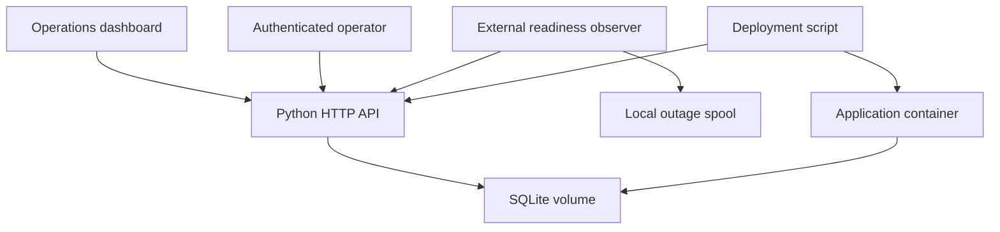
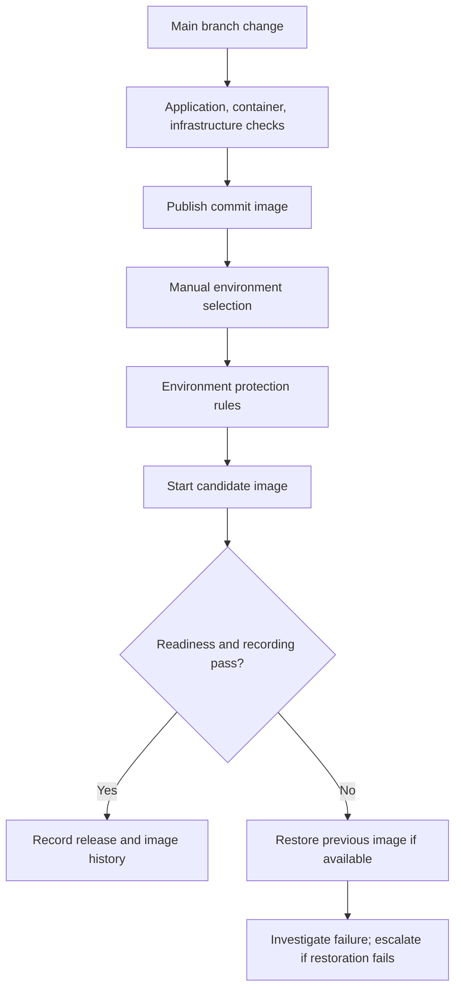

# System design

The browser reads the application API and displays the workspace. Authorized writes become SQLite transactions and activity events. A separate observer probes readiness and uploads measurements. The deployment process operates Docker and records a release only after its checks pass.

## Delivery flow

## Data design

| Table | Key | Purpose |
|---|---|---|
| tasks | Integer ID | Work items, owner, priority, status, timestamps, example flag |
| incidents | Integer ID | Service issue, severity, lifecycle, resolved timestamp, example flag |
| releases | Integer ID | Version/image/environment/action ledger |
| probes | Observer-generated UUID | Deduplicated health observations and latency |
| events | Integer ID | Recent task, incident, and release changes |

One database belongs to one environment. Probe storage is pruned during ingestion to 48 hours. API responses show the latest 100 work items, incidents, releases, and events; the dashboard is deliberately small and has no pagination. Counts and 24-hour probe aggregates are calculated across all matching rows. Recent charts show at most 120 observations, and the plotted chart shows the latest 60.

## Release and storage behavior

The application version is baked into the Docker image. CI supplies the Git commit; the deployment script can enforce `EXPECTED_VERSION`. Both candidate and rollback use the environment’s persistent volume. Deployments have a host lock and GitHub concurrency group. Successful image history is outside the checkout under `/opt/releaseops/state` in CI, so checkout cleanup cannot delete it.

Container replacement is single-host and permits downtime. Schema version 1 uses additive table initialization. A future incompatible migration requires a migration/restore plan before release. Rollback replaces application code, not stored data. The self-hosted runner is a deployment dependency, not part of the HTTP request path.
